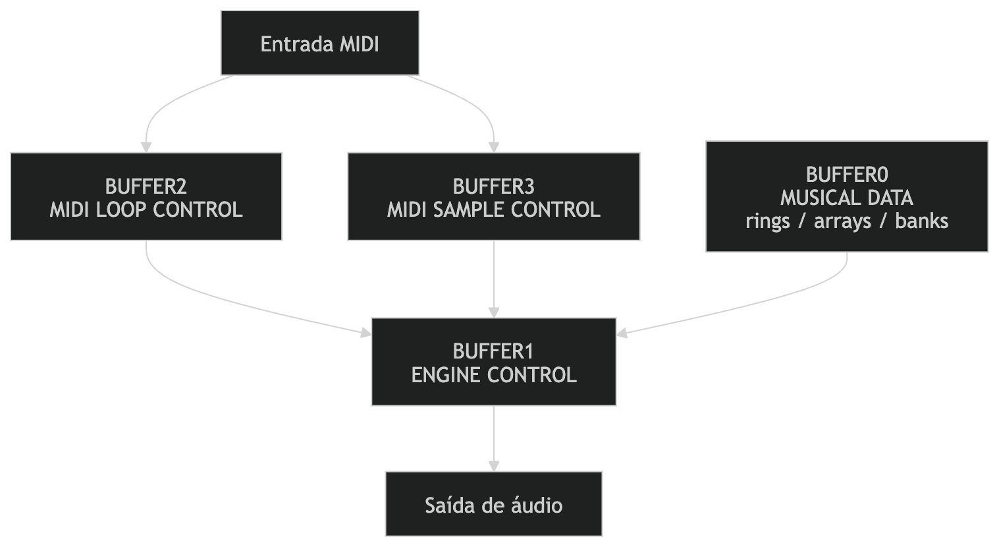

# Live Coding Performance System  
### Sonic Pi + MIDI Controller + RP2040

Sistema de performance musical em **live coding** baseado na integração entre **programação musical**, **controladores físicos** e **mensagens MIDI em tempo real**.

O projeto explora a ideia de transformar **gestos físicos simples — botões e potenciômetros — em manipulação direta de estruturas musicais dentro do Sonic Pi**, criando um ambiente híbrido entre programação, instrumento musical e performance ao vivo.

---

## Visão Geral

Este projeto propõe uma arquitetura de performance onde três camadas trabalham juntas:

1. **Interface física**  
   Um controlador MIDI construído com microcontrolador **RP2040** envia mensagens MIDI a partir de botões e potenciômetros.

2. **Camada de controle musical**  
   O **Sonic Pi** recebe essas mensagens MIDI e as converte em parâmetros que controlam estruturas musicais.

3. **Engine musical**  
   Loops e buffers no Sonic Pi geram padrões rítmicos, linhas de baixo, melodias e manipulações sonoras em tempo real.

O resultado é um sistema onde o performer pode **programar e tocar ao mesmo tempo**, manipulando o comportamento da música durante a execução.

---

## Arquitetura do Sistema

A lógica geral de funcionamento pode ser resumida da seguinte forma:

Cada ação física realizada no controlador altera algum aspecto da música em execução, como:

- troca de padrões rítmicos
- variação de BPM
- seleção de modos musicais
- manipulação de filtros
- ativação de samples

---

## Estrutura do Sistema no Sonic Pi

A organização do código utiliza **buffers separados**, cada um responsável por uma camada do sistema.

Essa divisão permite manter o código organizado e facilita a manipulação de diferentes partes da engine musical durante a performance.

Essa arquitetura permite separar claramente:

- **dados musicais**
- **lógica da engine**
- **controle de loops**
- **controle de samples**

O sistema torna-se assim mais **modular, performático e fácil de expandir**.

---

## Interface Física

O controlador físico é baseado em um **microcontrolador RP2040**, programado para enviar mensagens MIDI.

A interface inclui:

- botões (trigger e seleção de modos)
- potenciômetros (controle contínuo)
- comunicação USB MIDI

Cada controle físico corresponde a um **parâmetro musical dentro do Sonic Pi**, permitindo manipulação direta da performance.

---

## Objetivo do Projeto

O projeto investiga formas de **performance musical baseada em código**, aproximando três dimensões principais:

- **instrumento musical**
- **programação**
- **improvisação**

A proposta é criar um ambiente onde o performer possa:

- escrever código musical
- modificar o comportamento da música em tempo real
- interagir fisicamente com o sistema

Esse tipo de abordagem aproxima o **live coding de uma prática instrumental**, onde o código funciona como material performático.

---

## Tecnologias Utilizadas

- Sonic Pi  
- MIDI  
- RP2040  
- CircuitPython  
- Ruby (linguagem utilizada no Sonic Pi)

---

## Autor

**Erwin Kuchenbecker**

Erwin desenvolve projetos com microcontroladores voltados à **geração sonora e aplicações musicais embarcadas**, integrando conceitos de eletrônica, acústica e linguagem musical.

Possui formação em **Licenciatura em Música pela UFRJ** e atualmente estuda **Redes de Computadores**, realizando projetos e laboratórios práticos em **sistemas embarcados que unem música e tecnologia**.